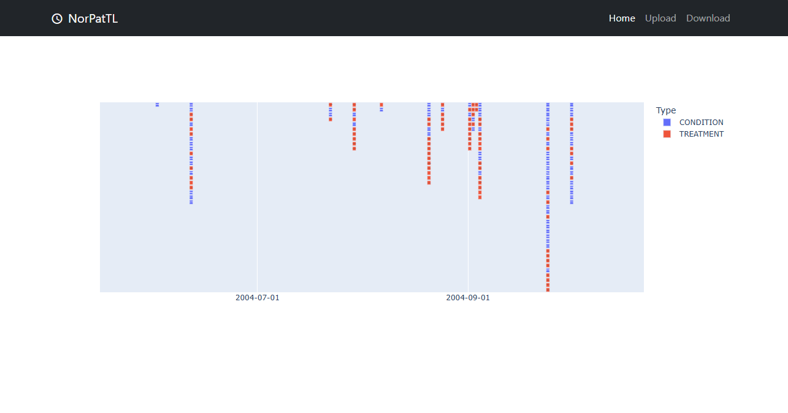
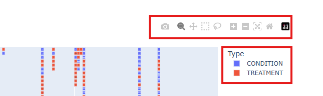
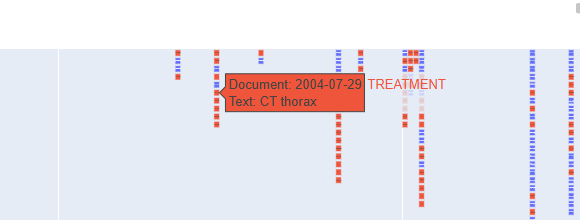
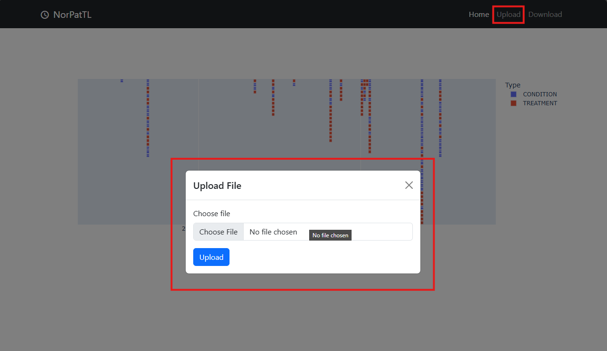
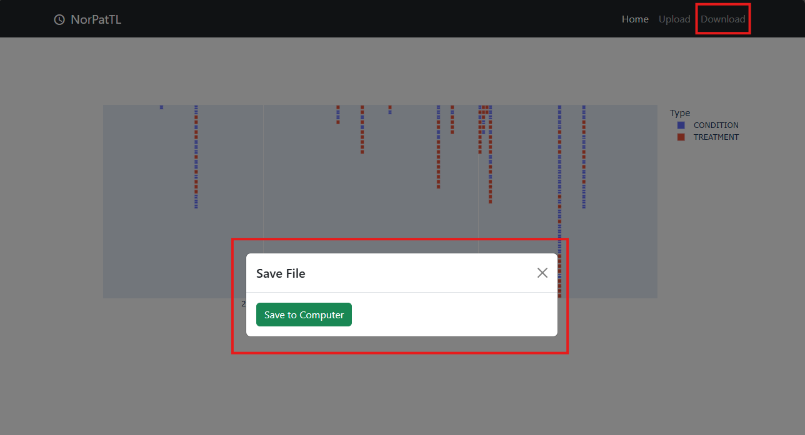

# NorPatTL: Web application

This app is only for demonstrating how the result of this proposed architecture can be used. This application requires the running PC to have GPU resource, because of the machine learning models the proposed pipeline use.

## Requirements

This application is developed mainly using `flask` as backend and `bootstrap` as frontend styler. The `flask` backend depends on 

## How to run

To run the application from the root folder, run the following command in the terminal:
> poetry run python app/app.py

Else, it is also possible to run the application as follows if you are in the [app](/app) folder:
> flask run

Both commands will run the webpage on your local machine and the webpage will be available at [http://127.0.0.1:5000/](http://127.0.0.1:5000/).

## Features
The following section presents the available functionality of the webpage.

### Visualization of patient timelines

### Interactive graph

### Description of each node

### Upload patient journals

### Download CSV

